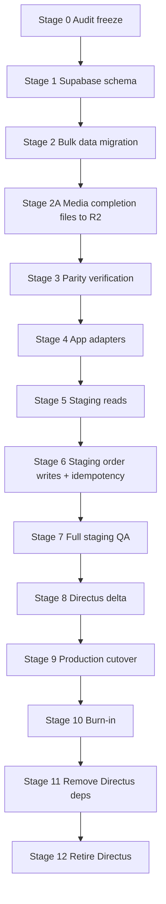

# DIRECTUS → SUPABASE MASTER PLAN — Complete Directus Retirement

> **Previous customer-only cutover strategy is cancelled. The target is complete Directus retirement.**

**Дата:** 2026-10-03  
**Repository:** `MaxBal/carzo-storefront` · branch `dev` · baseline HEAD `2e4a773cc888990f11d26dffbbdc482e7c60272e`  
**Supabase:** `Carzo` / `kmhegysmtsjqtwwaacht`  
**Status of this document:** AUTHORITATIVE migration plan for remaining work. Supersedes customer-only cutover plan for implementation scope. Historical docs are retained for reference.

**Related:**
- `docs/DIRECTUS_FULL_AUDIT.md` — live audit
- `docs/SUPABASE_TARGET_ARCHITECTURE.md` — target schema
- `docs/SUPABASE_CURRENT_STATE.md` / `docs/SUPABASE_HANDOFF.md` — prior customer work (completed, not redone)

---

## 0. Principles

1. **Audit/architecture done. Implementation begins only after Stage 0 freeze.**
2. Final goal: **Directus can be switched off permanently** without losing functionality or data.
3. Preserve: storefront behavior, pricing correctness, checkout reliability, loyalty, order history, SEO, CMS content, media URLs, notifications, draft/preview where needed.
4. No dual-backend forever — stages converge to one backend.
5. No silent pricing fallback after cutover (fail closed).
6. Customer/loyalty/checkout reliability work already completed — **do not redo** unless incompatibility appears.
7. This plan is **not** executed by this document session.

---

## STAGE 0 — Audit freeze & prerequisites

### Goal
Lock the verified baseline and prevent Directus drift during migration implementation.

### Scope
Process + documentation only. Optional: operational freeze notices.

### Preconditions
- [x] Live Directus audit complete
- [x] Supabase current state verified
- [x] Target architecture designed
- [x] Master plan written
- [ ] Team agreement: no Directus schema/content changes during active migration windows

### Actions
1. Record git baseline SHA (this plan header).
2. Freeze Directus schema changes (`setup-directus.mjs` must not run).
3. Freeze non-emergency Directus content edits during Stage 2–3 and Stage 8 windows.
4. Confirm env inventory (Directus, Supabase, Telegram, Nova Poshta) without printing secrets.
5. Confirm R2 media host convention `https://media.carzo.com.ua`.

### Verification
- `git status` clean; plan docs only.
- No `setup-directus` / import scripts executed.

### Failure conditions
- Unapproved Directus schema change during freeze → re-run drift delta before Stage 2.

### Rollback
N/A (process).

### Deliverables
- This plan + audit + architecture docs.

### Git checkpoint
Docs-only commit: `docs: directus full audit, supabase target architecture, migration master plan`.

---

## STAGE 1 — Supabase schema foundation

### Goal
Create target tables, constraints, indexes, RLS, triggers — empty of app data (or with only reference seeds).

### Scope
Supabase migrations only (new tables). **No Directus changes. No app cutover.**

### Preconditions
- Stage 0 complete
- Target architecture reviewed/approved
- Migration naming convention agreed

### Actions
1. Add migrations for catalog/content/pages/settings/orders/notification tables per architecture (**exact Stage 1 set — 27 tables**):
   - catalog (7): `designs`, `sizes`, `brands`, `variants`, `fixations`, `fixation_size_extras`, `discount_tiers`
     - `brands.logo_extra integer not null default 0` (source: `carzo_brand_pricing.logo_extra`; **no** `brand_logo_pricing` table)
     - `fixation_size_extras(fixation_id, size_id, extra)` with real FK to `sizes(id)`
   - content (7): `gallery_images`, `content_sets`, `content_sections`, `faq_items`, `rich_sections`, `rich_section_images`, `benefit_modals`
   - media/site (3): `logo_settings`, `product_media`, `site_settings` (**no** `logo_placements`)
   - settings split (5): `homepage_settings`, `about_settings`, `review_settings`, `video_review_settings`, `car_mat_settings`
   - cms (2): `pages`, `page_blocks`
   - orders (2): `orders`, `order_items`
   - notifications (1): `notification_settings` (**no** `directus_user_ids`)
2. Implement `set_updated_at()` trigger + apply.
3. Implement RLS: enabled on all tables; **server-first** — no broad `anon`/`authenticated` policies; service-role only. Do not create dummy policies.
4. Optional: RPC skeleton `create_order_with_items` (non-executable until Stage 6 code) — or defer RPC to Stage 6.
5. Do **not** change `public.customers` except optional additive FKs later.
6. Record migration versions in handoff.

### Verification
- `supabase migrations list` matches expected versions.
- Tables exist; PK/UNIQUE/FK/CHECK as specified.
- `customers` unchanged (row count 5994).
- RLS is enabled on every target application table
- there are **no** unintended `anon` or `authenticated` grants/policies
- service-role/server access works
- `rls_enabled_no_policy` INFO is **expected and acceptable** for intentionally server-only tables
- this advisor message must **not** be treated as Stage 1 failure by itself
- do **not** create dummy policies merely because RLS is enabled
- No application deploy.

### Failure conditions
- Migration fails or schema mismatches architecture.
- Unexpected change to `customers`.

### Rollback
- `reset`/`down` migration or drop only newly created tables (never drop customers).

### Deliverables
- New Supabase migrations in repo `supabase/migrations/` (or project migration path used previously).
- Schema verification notes.

### Git checkpoint
`feat: add supabase target schema for directus exit`.

---

## STAGE 2 — Read-only bulk data migration (Directus → Supabase)

### Goal
Copy all application data into Supabase with integrity preserved. Directus remains readable source.

### Scope
Migration scripts + data load. **No production traffic switch. No Directus mutations** (read-only export).

### Preconditions
- Stage 1 applied
- Export scripts read-only
- Snapshot of Directus export timestamp recorded

### Actions
1. Export in dependency order:
   1. designs, sizes, brands (**logo_extra from `carzo_brand_pricing`**), fixations (+ expand `extra_by_size` → `fixation_size_extras` with `size_id`), discount_tiers
   2. variants
   3. content_sets → content_sections, faq_items
   4. rich_sections → rich_section_images
   5. gallery_images, logo_settings, **product_media (17 canonical slots)**
   6. split site_settings fields into settings tables
   7. benefit_modals
   8. pages → page_blocks
   9. notification_settings (non-secret) + telegram chat_ids (**drop `directus_user_ids`**)
   10. orders → order_items (parse loyalty JSON from manager_note into `loyalty_*` columns only; preserve genuine manager text; **preserve `customer_email`**; **no `legacy_manager_note`**)
2. Normalize media references to R2 URLs during load where already present; remaining Directus-file-only media is **Stage 2A**.
3. Preserve historical order timestamps and snapshots exactly (including `customer_email` when present). Directus `created_at` → `orders.created_at` directly.
4. Do not import `site_settings.customers` as new customers (already in `public.customers`); only link if needed.
5. Store Telegram bot token only in env — never copy into Supabase.
6. Do **not** create `logo_placements` (archive/legacy only).

### Verification
- Row counts match audit inventory (§5 of audit).
- Natural keys unique in target.
- Orphan checks = 0.
- Sample parity hash on N rows per table (field-level, no PII dump).
- Order totals/line totals equal source.
- Historical `created_at` preserved directly in `orders.created_at` (no `created_at_source`).
- Source collection set accounted for: **24** migratable collections (`logo_placements` excluded; brand_pricing merged; site_settings split).
- No secrets written to Supabase tables.

### Failure conditions
- Count mismatch beyond documented empty/legacy exclusions.
- Integrity orphans.
- Secret leaked into DB.

### Rollback
- Truncate/reload migrated tables (not customers).
- Directus untouched.

### Deliverables
- Migration loader scripts (read-only vs Directus).
- Load report (counts, checksums).

### Git checkpoint
`feat: bulk migrate directus application data to supabase (staging load)`.

---

## STAGE 2A — MEDIA COMPLETION (DIRECTUS FILES → R2)

### Goal
Make R2 complete for all published/required production media so no runtime path depends on Directus file UUIDs.

### Scope
Media inventory + R2 mapping/copy + Supabase media URL updates. Directus remains read-only source of file metadata. **Do not execute media deletion.**

### Preconditions
- Stage 2 bulk structured-data migration completed (or at least tables exist and media columns are ready)
- R2 write credentials available for **required object copy only**
- Audit media inventory reviewed (design selectors, rich-section images, logo fallback, mixed pairs)

### Actions
1. Enumerate all published/required media still depending on Directus file UUIDs, including at least:
   - 3 design selector images (`carzo_designs.selector_image`)
   - 3 rich-section images file-only rows
   - logo fallback media (`carzo_logo_settings.fallback_image`)
   - any other mixed/file-only fallback fields identified by the audit
2. Resolve Directus file metadata (filename, type, size, hash if available) — read-only.
3. Detect whether an equivalent R2 object already exists (by URL companion, hash, or path convention on `media.carzo.com.ua`).
4. Map existing R2 object when available (no copy).
5. Otherwise copy the required object to the correct Carzo R2 path/convention.
6. Update Supabase media URL / object-key reference for the affected rows/settings.
7. Validate every resulting R2 URL/object (HTTP reachability + content-type sanity).
8. Produce a media completion report (counts, copied vs mapped, remaining gaps).

### Stage 2A PASS condition

```
critical Directus-file-only production media dependencies = 0
```

### Verification
- Inventory table empty for critical published media.
- Spot-check PDP/homepage/logo/rich-section media loads from R2 only.
- Report lists any non-critical leftovers explicitly.

### Failure conditions
- Any critical published media still file-only after Stage 2A.
- Broken R2 object written to Supabase.

### Rollback
- Revert Supabase media URL columns to previous values; R2 copies may remain (harmless extra objects).

### Deliverables
- Media completion report.
- Updated Supabase media references.

### Git checkpoint
`feat: complete r2 media mapping for directus file fallbacks` (tooling/report as applicable).

> **This correction session only documents Stage 2A. Do not execute it now.**

---

## STAGE 3 — Data verification

### Goal
Prove parity before any app adapter trusts Supabase.

### Scope
Verification tooling + reports.

### Preconditions
- Stage 2 load completed
- **Stage 2A media completion PASS** (critical Directus-file-only media = 0)

### Actions
1. Run full check list (Phase T):
   - duplicate keys = 0
   - orphan FK = 0
   - every variant has design + size
   - order/item counts equal
   - order_number set equality
   - totals equality
   - media URL non-empty for published content (or documented fallback)
2. Pricing parity: quote same cart fixtures via Directus reader vs Supabase reader (script).
3. Content parity: rendered block inventory counts.
4. **Historical order parity** (no PII dumps — use aggregates/equality/hashes):
   - order count
   - order item count
   - order_number set
   - status
   - created_at
   - customer_name
   - customer_phone
   - **customer_email when present**
   - customer_comment
   - contact_method
   - delivery snapshot
   - subtotal / quantity_discount / total
   - discount_tier_key
   - line-item snapshots
   - loyalty audit transformation (manager_note JSON → structured columns)
5. Document known intentional diffs (dropped legacy fields, no `logo_placements`, no `directus_user_ids`).

### Verification
- Parity report PASS.
- Pricing fixture PASS.

### Failure conditions
- Any pricing mismatch.
- Missing published media critical for PDP.

### Rollback
- Fix data or reload Stage 2; do not proceed.

### Deliverables
- `docs/migration-parity-report.md` (or under `docs/` as agreed).

### Git checkpoint
Docs + test scripts.

---

## STAGE 4 — Supabase application adapters

### Goal
Implement domain repositories and swap-ready readers/writers without flipping production.

### Scope
Application code behind feature flags. Staging default may already use Supabase reads.

### Preconditions
- Stage 3 PASS
- Flags exist: `CATALOG_STORE`, `CONTENT_STORE`, `PAGE_STORE`, `ORDER_STORE` (and existing `CUSTOMER_STORE`)

### Actions
1. Implement `lib/data/*` repositories per architecture.
2. Wire content/resolver/homepage/about/modals/car-mats/site-flag/pages/sitemap to repositories.
3. Implement cart quote against Supabase catalog (fail-closed).
4. Implement order repository + RPC create path (still flag-gated).
5. Notification settings reader from Supabase; Telegram token from env only.
6. Media resolver: R2 URL only (Directus fallback behind temporary flag if needed).
7. Keep UI components unchanged where domain APIs preserved.
8. Typecheck/lint/build green.

### Verification
- `pnpm exec tsc --noEmit`
- `pnpm run lint`
- `pnpm run build`
- Unit tests for pricing/loyalty/checkout-reliability still pass.
- New repository tests pass.

### Failure conditions
- Type errors; pricing unit tests fail; unexpected UI contract breaks.

### Rollback
- Flags remain on Directus; revert adapter PR.

### Deliverables
- Adapters, flags, tests.

### Git checkpoint
`feat: supabase data adapters for catalog/content/pages/orders`.

---

## STAGE 5 — Staging read cutover

### Goal
Staging reads catalog/content/pages/settings from Supabase. Directus remains rollback source.

### Scope
Staging env flags only.

### Preconditions
- Stage 4 complete
- Staging deploy available

### Actions
1. Set staging `CATALOG_STORE=supabase`, `CONTENT_STORE=supabase`, `PAGE_STORE=supabase`.
2. Keep `ORDER_STORE=directus` initially (writes still Directus) OR move writes in Stage 6 — prefer reads first if order dual-write risk is high.
3. Deploy staging.
4. Smoke: homepage, about, product pages (all designs/sizes), car mats, modals, CMS pages, SEO, preview.

### Verification
- Staging QA checklist (reads) green.
- No Directus read errors in staging logs for switched domains.

### Failure conditions
- Broken PDP/pricing/content.
- Media 404s.

### Rollback
- Flip read flags to `directus`; redeploy staging.

### Deliverables
- Staging QA notes.

### Git checkpoint
N/A (env config) + docs note.

---

## STAGE 6 — Checkout / order write cutover (staging first)

### Goal
Supabase becomes authoritative for orders + order items + loyalty audit. Notifications remain best-effort post-commit.

### Scope
Order write path + idempotency. Staging, then later production.

### Preconditions
- Stage 5 reads stable
- RPC `create_order_with_items` implemented + tested
- `checkout_attempt_id` designed and present

### Actions
1. Implement atomic order create RPC with `checkout_attempt_id` **mandatory non-null for every new order** (reject null; UNIQUE; retry returns/reuses existing order).
2. DB column remains `checkout_attempt_id uuid null unique` so legacy imported orders can be NULL — this does **not** mean new orders may omit it.
3. Replace `writeOrder` Directus POST with Supabase repository.
4. Persist structured loyalty columns (stop writing loyalty JSON to manager_note).
5. Preserve `customer_email` as historical snapshot field only — not required for new checkout; not a contact_method value.
6. `contact_method` values must match app contract exactly: `phone`, `telegram`, `viber`, `whatsapp`.
7. Preserve `runPostOrderSideEffects` semantics: notify + customer upsert cannot fail client after commit.
8. Generate order numbers server-side with uniqueness.
9. Enable `ORDER_STORE=supabase` on staging.
10. Test retries with same attempt id (no duplicate orders).

### Verification
- Staging E2E checkout (branch/postomat/courier).
- Loyalty applied correctly (5%, mismatch cases).
- Quantity discount tiers 2/3.
- Notification Telegram message contents (incl. discount breakdown) — non-blocking failures simulated.
- Duplicate submit with same attempt id → single order.
- Typecheck/lint/build.

### Failure conditions
- Duplicate orders on retry.
- Wrong totals.
- Side-effect failure flipping client to error after success.

### Rollback
- `ORDER_STORE=directus` **only if** no Supabase-only orders yet; else reconciliation (see rollback section).

### Deliverables
- Order RPC migration, checkout code, tests.

### Git checkpoint
`feat: supabase authoritative order writes with idempotency`.

---

## STAGE 7 — Full staging QA

### Goal
End-to-end product confidence before production cutover.

### Scope
QA only.

### Preconditions
- Staging on Supabase reads + writes (or writes still Directus if deferred — then QA reads only and order QA is partial)

### Actions
QA matrix (desktop + mobile):

| Area | Checks |
|---|---|
| Catalog | all designs × sizes, brands, prices, old prices, stock flags |
| Product page | gallery, content tabs, FAQ, rich sections, logo block, magnetic covers per design/size, fixation extras by size |
| Homepage | hero, badges, quality, logo video |
| About | hero, process, principles, development, statement |
| Car mats | designs, modal, promo video/cover |
| Modals | all 6 benefit modals |
| Reviews | text reviews, CTA, video reviews block, social |
| CMS pages | published legal pages; draft preview |
| Checkout | quote, discounts, loyalty, Nova Poshta, validation; **idempotent retry with same checkout_attempt_id** |
| Orders | create, notification payload; historical parity fields incl. customer_email when present |
| SEO | sitemap, metadata, no_index |
| Preview | draft mode with secret |
| Media | R2 URLs load for all critical published media (**Stage 2A complete**); no Directus asset calls in staging logs |

### Verification
- QA checklist signed off.
- Browser network: zero `/api/directus-assets` and zero Directus host calls (for switched domains).

### Failure conditions
- Any P0 regression.

### Rollback
- Fix forward or flag rollback.

### Deliverables
- Staging QA report.

### Git checkpoint
Fixes as needed.

---

## STAGE 8 — Directus delta migration (pre-production)

### Goal
Capture changes made in Directus after initial bulk load.

### Scope
Short freeze window + delta import.

### Preconditions
- Stage 7 PASS
- Production cutover scheduled

### Actions
1. Freeze Directus writes (announce).
2. Export delta since Stage 2 snapshot (by updated timestamps if available; else full compare).
3. Upsert delta into Supabase.
4. Re-run count/integrity/price parity for touched entities.
5. Keep Directus frozen until Stage 9 completes.

### Verification
- Delta report zero unexpected misses.
- Fresh inventory counts match.

### Failure conditions
- Unexplained drift.

### Rollback
- Stay on Directus; unfreeze; replan.

### Deliverables
- Delta export + parity update.

### Git checkpoint
Tooling only.

---

## STAGE 9 — Production backend cutover

### Goal
Production storefront uses Supabase for all domains; Directus no longer in runtime path.

### Scope
Production env + deploy. Controlled sequence.

### Preconditions
- Stage 8 complete
- Rollback plan reviewed (split-brain warning for orders)
- On-call ready

### Actions
1. Production env:
   - `CATALOG_STORE=supabase`
   - `CONTENT_STORE=supabase`
   - `PAGE_STORE=supabase`
   - `ORDER_STORE=supabase`
   - `CUSTOMER_STORE=supabase` (if not already)
   - Telegram token from env
2. **Runtime Directus dependency = zero:** normal storefront makes no Directus requests.
3. **Do not immediately permanently revoke every Directus token at Stage 9** if Stage 10 still needs forensic/rollback access.
4. Directus credentials during Stage 9–10:
   - may remain securely available for **migration/ops rollback only**
   - must **not** be used by normal runtime
   - where practical, keep them separate from the regular runtime environment (not in the production app env used by the storefront)
5. Directus remains frozen/read-only during burn-in.
6. Deploy production.
7. Smoke: PDP, homepage, checkout happy path, notification.
8. Monitor logs 24–72h.

### Verification
- Production smoke green.
- Zero runtime requests to Directus host in logs.
- Orders inserting into Supabase.

### Failure conditions
- Checkout broken, pricing wrong, content outage.

### Rollback
- See § Rollback after Supabase writes (no naive flag flip once orders flow).

### Deliverables
- Cutover log.

### Git checkpoint
Release tag.

---

## STAGE 10 — Burn-in

### Goal
Stability period with Directus available read-only as forensic rollback source.

### Scope
Operations.

### Preconditions
- Stage 9 successful

### Actions
1. Directus set read-only / unused by app (network isolation optional).
2. Operational/rollback credentials may remain available for migration/ops — **not** in normal storefront runtime env.
3. Monitor: checkout errors, notification failures, media 404s, parity alerts.
4. Retain ability to export Directus backup.

### Verification
- Burn-in duration agreed (recommend **≥7–14 days** with successful order volume).
- No critical incidents requiring Directus restore.

### Failure conditions
- Repeated critical incidents.

### Rollback
- Only via documented data reconciliation (orders already in Supabase).

### Deliverables
- Burn-in report.

---

## STAGE 11 — Directus dependency removal

### Goal
Delete all runtime and tooling coupling to Directus from the repository.

### Scope
Code cleanup + env cleanup.

### Preconditions
- Stage 10 accepted

### Actions
Remove / replace:
- `lib/content/directus.ts`, `lib/pages/directus.ts`
- Directus branches in `lib/media.ts`, `resolveMediaUrl`
- `app/api/directus-assets/[id]/route.ts`
- `lib/cart/customer-store/directus.ts` and `CUSTOMER_STORE` flag
- Directus calls in `lib/cart/server.ts`, `checkout.ts` `writeOrder`, `order-notifications.ts` settings reads
- scripts: `setup-directus.mjs`, `validate-directus-access.mjs`, `verify-directus-access.mjs`, `import-carzo-4-media.mjs` (as applicable)
- `directus/access-control.mjs`, `navigation.mjs` (or archive)
- package scripts referencing Directus
- env vars: `DIRECTUS_URL`, `DIRECTUS_READ_TOKEN`, `DIRECTUS_ADMIN_TOKEN`
- rename `DIRECTUS_PREVIEW_SECRET` → `PREVIEW_SECRET`
- update docs/AGENTS.md architecture notes
- tests updated to Supabase-only

Credentials/tooling cleanup at Stage 11:
- remove Directus **runtime** env contract
- migrate any remaining ops credentials out of deployable runtime config
- prepare token revocation list for Stage 12

### Verification
- `rg -i directus` shows only historical docs/ADR/archive or intentional comments.
- typecheck/lint/build/test green.
- production deploy clean.

### Failure conditions
- Any remaining runtime import of Directus client.

### Rollback
- Git revert; redeploy previous release.

### Deliverables
- Cleanup PR.

### Git checkpoint
`chore: remove directus runtime and tooling`.

---

## STAGE 12 — Directus retirement

### Goal
Permanently decommission Directus.

### Scope
Archival + infrastructure shutdown.

### Preconditions
- Final acceptance criteria (below) ALL pass
- Stage 11 deployed and stable

### Actions
1. Final Directus export/archive (schema + data + files list).
2. Store encrypted archive offline / in secure bucket (not public).
3. **Revoke/delete Directus tokens** and secrets/tooling (now that burn-in rollback is no longer required).
4. Disable application access to Directus.
5. Retain migration backup of Supabase load reports.
6. Decommission Railway Directus service.
7. Update inventory/secrets scanners.

### Verification
- Archive integrity (checksums).
- Directus hostname no longer required.
- Secrets removed from Vercel.

### Rollback
- Restore from archive only in disaster; not a supported runtime rollback.

### Deliverables
- Retirement checklist + archive location note (no secrets).

---

## Order migration strategy (detail)

### Current (audited)
- 10 orders / 17 items (staging-or-shared history as present live)
- statuses all `new`
- date range 2026-07-28 … 2026-10-02
- order_number unique
- loyalty audit in `manager_note` JSON on applicable orders

### Requirements
- Preserve historical orders exactly (no recompute).
- Map manager_note loyalty JSON → structured `orders.loyalty_*` columns only.
- Do **not** create `legacy_manager_note`. Do **not** keep loyalty JSON in production `manager_note`.
- Preserve genuine human/freeform manager text (if any) in `orders.manager_note`; otherwise leave NULL.
- Preserve `customer_email` exactly when present (historical snapshot; not required for new orders).
- Parity tooling must verify loyalty parse completeness without printing note payloads / PII.
- Verification (no PII prints; use aggregates/equality/hashes):
  - order count / item count
  - order_number set equality
  - status
  - created_at
  - customer_name
  - customer_phone
  - customer_email when present
  - customer_comment
  - contact_method
  - delivery snapshot
  - subtotal / quantity_discount / total
  - discount_tier_key
  - line-item snapshots
  - loyalty audit transformation

### Production historical volume
When migrating production Directus orders (if more than the audited 10 appear in the production instance), re-run inventory first; plan assumes **bulk order migration is exact copy**.

---

## Rollback design (detail)

### Before Supabase authoritative writes
- Domain flags back to Directus.
- Supabase can be reloaded later.

### After Supabase authoritative order writes begin
**Naive `ORDER_STORE=directus` flip is forbidden** without reconciliation because:
- new orders exist only in Supabase
- order_number sequences may diverge
- customer upserts may have occurred

Required rollback procedure:
1. Stop accepting orders (maintenance) if checkout is broken.
2. Export Supabase orders created after cutover.
3. Decide: continue forward on Supabase (preferred) or backfill Directus (only if still up and policy allows).
4. Re-enable traffic only after single-writer truth is restored.
5. Document any gap as incident.

### Media rollback
- R2 remains SoT; no media rollback needed if Directus not serving assets.

---

## Cutover flags (temporary)

| Flag | Stage introduced | Stage removed |
|---|---|---|
| `CUSTOMER_STORE` | already exists | Stage 11 |
| `CATALOG_STORE` | Stage 4 | Stage 11 |
| `CONTENT_STORE` | Stage 4 | Stage 11 |
| `PAGE_STORE` | Stage 4 | Stage 11 |
| `ORDER_STORE` | Stage 4/6 | Stage 11 |

**Final architecture has zero Directus flags.**

---

## Observability (during cutover)

Minimum signals:
- checkout error rate / RPC errors
- Supabase insert/update failures
- notification send failures
- media resolution failures
- invalid variant lookups
- unexpected Directus host calls (should go to zero)

---

## Final Directus retirement acceptance criteria

All must pass:

- [ ] zero runtime GET/POST/PATCH/DELETE to Directus
- [ ] no `DIRECTUS_URL` / `DIRECTUS_READ_TOKEN` / `DIRECTUS_ADMIN_TOKEN` runtime dependency
- [ ] no Directus asset URLs or file UUIDs in app data path
- [ ] no Directus page/catalog/order/notification config reads
- [ ] all required media resolves from R2 (Stage 2A critical leftovers = 0)
- [ ] Supabase data parity checks pass (incl. historical order fields and loyalty transform)
- [ ] production checkout works
- [ ] loyalty works
- [ ] Telegram notification works
- [ ] Nova Poshta flow works
- [ ] CMS/pages/SEO work
- [ ] preview/draft works (if retained)
- [ ] order history migration verified
- [ ] new orders always have non-null `checkout_attempt_id` (legacy may be NULL)
- [ ] Directus final backup/export created
- [ ] burn-in completed
- [ ] rollback no longer required
- [ ] Directus tokens revoked/deleted (Stage 12; not required at Stage 9)
- [ ] Telegram bot token lives only in env
- [ ] codebase has no runtime Directus imports
- [ ] `directus_user_ids` / `logo_placements` / `brand_logo_pricing` absent from target schema

---

## Stage dependency graph



---

## Risk register (material)

| Risk | Mitigation |
|---|---|
| Split-brain orders on naive rollback | explicit post-write rollback protocol; single writer |
| Duplicate checkout submits | `checkout_attempt_id` mandatory for new orders + UNIQUE + retry reuse |
| Media file-only leftovers | Stage 2A PASS before parity/cutover |
| Pricing served from stale fallback | fail-closed commerce; remove pricing fallbacks at cutover |
| Secret leak (Telegram token) | env-only; never migrate token column |
| Media 404 after dropping Directus fallback | Stage media completion checklist before Stage 11 |
| Directus edits during migration | Stage 0/8 freezes |
| Historical order mutation | snapshot fields; no recompute |
| Hidden site_settings consumers | split carefully; keep domain API mapping tests |
| Empty/legacy collections confusion | dispositions in audit; skip empty tables if agreed |
| Notification failure after order success | preserve checkout-reliability semantics + tests |

---

## Out of scope for implementation sessions until Stage 0 sign-off

- Creating real migrations
- Running data exports/imports
- Deploying production
- Flipping any `*_STORE` flags
- Deleting Directus code
- Shutting down Directus

---

## Recommended immediate next implementation step

**Stage 1 only:** write Supabase schema migrations from `docs/SUPABASE_TARGET_ARCHITECTURE.md` for the **exact 27-table** set (no data load, no media copy, no app flip).

### Stage 1 exact table list (must match architecture)

`designs`, `sizes`, `brands`, `variants`, `fixations`, `fixation_size_extras`, `discount_tiers`,  
`gallery_images`, `content_sets`, `content_sections`, `faq_items`, `rich_sections`, `rich_section_images`, `benefit_modals`,  
`logo_settings`, `product_media`, `site_settings`,  
`homepage_settings`, `about_settings`, `review_settings`, `video_review_settings`, `car_mat_settings`,  
`pages`, `page_blocks`,  
`orders`, `order_items`,  
`notification_settings`

Existing application table kept: `customers` (1). Final total = **28**.

Not created in Stage 1: `brand_logo_pricing`, `logo_placements`, `directus_user_ids`.
