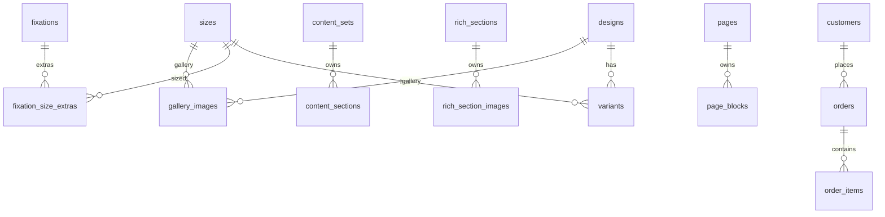

# SUPABASE TARGET ARCHITECTURE — Carzo Storefront

**Дата:** 2026-10-03  
**Статус:** DESIGN ONLY (не исполняемые миграции).  
**Supabase:** `Carzo` · `kmhegysmtsjqtwwaacht`  
**Основано на:** live Directus audit (`docs/DIRECTUS_FULL_AUDIT.md`)

---

## 1. Architecture principles

1. **Supabase = all structured application data** (catalog, content, pages, settings, orders, customers, notification config).
2. **Cloudflare R2 = all media binaries** (images/videos/covers). Supabase stores only stable URLs / object keys.
3. **Vercel/env secrets = secrets** (Telegram bot token, Nova Poshta key, Supabase service key, preview secret).
4. **Directus = temporary legacy source only**, then removed completely from runtime.
5. **No 1:1 `carzo_*` clone.** Normalize by domain; split the `carzo_site_settings` god-singleton; drop UI groups and empty legacy tables unless justified.
6. **Prices are integer whole UAH** (no floats). All monetary columns are `integer` UAH.
7. **Commerce-critical data is fail-closed** when backend is unavailable. Editorial content may use safe static fallback.
8. **Server-side data access is default.** Browser does not get unrestricted Supabase access.
9. **Order snapshots are immutable history** — never recompute old prices/titles from live catalog.
10. **Side-effect reliability preserved:** after successful order commit, notification/customer failures must not fail the client response.

### Source of truth (final)

| Layer | Source of truth for |
|---|---|
| Supabase | customers, catalog, variants, pricing, discounts, site/page content, settings, orders, order items, loyalty audit, notification config (non-secret) |
| Cloudflare R2 | images, videos, covers, media objects |
| Env / secret store | Telegram bot token, Nova Poshta key, Supabase server secret, preview secret |
| Git | application code, Supabase migrations, intentional seeds, architecture docs |
| Directus (after cutover) | **nothing** |

---

## 2. Naming conventions

| Rule | Value |
|---|---|
| Case | `snake_case` |
| Tables | plural (`designs`, `order_items`) |
| Columns | singular field names (`order_number`, `unit_price`) |
| PK | `id uuid primary key default gen_random_uuid()` |
| Timestamps | `created_at timestamptz not null default now()`, `updated_at timestamptz not null default now()` |
| FKs | `<table_singular>_id` (`design_id`, `order_id`) |
| Natural keys | `UNIQUE` constraints, not PK |
| Prefixes | **no** `carzo_` prefix unless needed for namespace clarity |
| Enums | only for stable business states (order status, page status) |

Shared trigger: `set_updated_at()` on mutable tables.

---

## 3. JSONB policy

### Use relational columns/tables for
- identities, FKs, pricing, quantities, totals, status
- searchable/filterable core data
- uniqueness / referential integrity
- loyalty audit fields
- notification routing values that are operational (chat IDs can be JSONB array but live in config table)

### JSONB is appropriate for
| Column | Why |
|---|---|
| `benefit_modals.content` | presentational typed blocks; no independent child lifecycle |
| `faq` lists inside page blocks (`page_blocks.items`) | presentational arrays |
| `about_settings.principles` / `process_blocks` | presentational arrays |
| `homepage_settings.hero_products`, `badges_features`, `quality_stats` | presentational arrays |
| `review_settings.items` | presentational review cards |
| `video_review_settings.items` | presentational video cards |
| `car_mat_settings.designs` | presentational array |
| `fixations.extra_by_size` | small fixed map `{s,m,l,xl}` OR normalize to 4 columns / child table — **recommend child table `fixation_size_extras`** because it is pricing-affecting |
| `logo_settings.specs` | presentational `[{label,value}]` |
| `notification_settings.telegram_chat_ids` | recipient ID array (non-secret) |
| `orders.delivery_snapshot` alternative | prefer explicit columns (already modeled) |

**Pricing-affecting values must not live in free-form JSON** (except tiny constrained maps if CHECKed — prefer columns).

---

## 4. Status / enum strategy

| Domain | Strategy | Values |
|---|---|---|
| catalog / content / pages | `text` + `CHECK` or small enum | `draft`, `published`, `archived` |
| orders | **Postgres enum** `order_status` | `new`, `in_progress`, `done`, `cancelled` (extend carefully) |
| delivery_method | enum | `BRANCH`, `POSTOMAT`, `COURIER` |
| contact_method | enum | `phone`, `telegram`, `viber`, `whatsapp` (exact app contract in `lib/cart/contact-method.ts`) |
| content kind | text + CHECK | `inside`, `fixation` |
| page_type | text + CHECK | `landing`, `legal`, `content` |

Do not create enums for rapidly changing marketing labels.

Order status transitions (documented, not enforced by trigger in v1 unless needed):

```
new → in_progress → done
new → cancelled
in_progress → cancelled
```

---

## 5. Proposed table model

> Existing table `public.customers` is **kept as-is**. Compatibility-only changes listed separately.

### 5.1 Customers (existing)

`public.customers` — already migrated (5994 rows).

| Column | Type | Notes |
|---|---|---|
| id | uuid PK | |
| phone | text UNIQUE | CHECK `^\+380[0-9]{9}$` |
| full_name | text null | |
| source | text default `site` | |
| imported | bool default false | |
| legacy_orders_count / legacy_products_count | int null | |
| legacy_city / legacy_delivery | text null | |
| created_at / updated_at | timestamptz | |

**Proposed (non-blocking) additions for whole-system architecture:**
- none required for catalog/content cutover
- optional later: `loyalty_discount_percent` if loyalty policy becomes per-customer instead of global 5%

**RLS category:** SERVER ONLY (keep current grants; optionally add explicit no-anon policies later).

---

### 5.2 Catalog domain

#### `designs`
| Column | Type | Null | Default | Constraint | Source |
|---|---|---|---|---|---|
| id | uuid | NO | gen_random_uuid() | PK | carzo_designs.id |
| slug | text | NO | | UNIQUE | carzo_designs.slug |
| label | text | NO | | | label |
| version | text | YES | | | version |
| sort | int | NO | 0 | | sort |
| status | text | NO | 'published' | CHECK in (draft,published,archived) | status |
| selector_image_url | text | YES | | | selector_image_url or resolved R2 |
| created_at / updated_at | timestamptz | NO | now() | | |

Indexes: `designs_slug_key`, `(status, sort)`.

#### `sizes`
| Column | Type | Notes |
|---|---|---|
| id | uuid PK | |
| code | text UNIQUE | `S`/`M`/`L`/`XL` |
| slug | text UNIQUE | |
| label | text | |
| content_group | text | `S`/`M`/`LXL` |
| height_cm / width_cm / depth_cm | int | product dims |
| shipping_length_cm / shipping_width_cm / shipping_height_cm | int null | from size_shipping if ever filled |
| shipping_weight_kg | numeric null | |
| sort / status | | |
| created_at / updated_at | | |

> **Decision:** merge empty `carzo_size_shipping` into `sizes` shipping columns (1:1, empty today). Do not keep a separate table.

#### `brands`
| Column | Type | Notes |
|---|---|---|
| id | uuid PK | |
| slug | text UNIQUE | includes `none` |
| name | text null | |
| flag | text null | |
| logo_extra | int NOT NULL default 0 | whole UAH; **source = `carzo_brand_pricing.logo_extra`** |
| logo_image_url | text null | R2 only |
| sort / status | | |
| created_at / updated_at | | |

> **Decision:** no separate `brand_logo_pricing` table. Live `carzo_brand_pricing` is a 1:1 brand extension with one operational value (`logo_extra`). Merge into `brands.logo_extra`. Do **not** trust legacy `carzo_brands.logo_extra` as authoritative during migration.

#### `variants`
| Column | Type | Notes |
|---|---|---|
| id | uuid PK | |
| key | text UNIQUE | `2-0:S` |
| design_id | uuid NOT NULL FK → designs | |
| size_id | uuid NOT NULL FK → sizes | |
| price | int NOT NULL | UAH |
| old_price | int null | display only |
| in_stock | bool NOT NULL default true | |
| quantity_discount_eligible | bool NOT NULL default true | |
| status | text | |
| created_at / updated_at | | |

Constraints: `UNIQUE (design_id, size_id)`, `CHECK (price >= 0)`, `CHECK (old_price IS NULL OR old_price >= price)` (optional).  
Indexes: `variants_key_key`, `variants_design_size_idx (design_id, size_id)`, `variants_status_idx`.

#### `fixations`
| Column | Type | Notes |
|---|---|---|
| id | uuid PK | |
| key | text UNIQUE | |
| label | text | |
| extra | int NOT NULL default 0 | base UAH |
| sort / status | | |
| created_at / updated_at | | |

#### `fixation_size_extras`
Pricing-affecting; relational with real size FK (not free-form `size_code` text).

| Column | Type | Notes |
|---|---|---|
| id | uuid PK | |
| fixation_id | uuid NOT NULL FK → fixations ON DELETE CASCADE | |
| size_id | uuid NOT NULL FK → sizes ON DELETE RESTRICT | real catalog size |
| extra | int NOT NULL default 0 | CHECK `extra >= 0` |
| created_at / updated_at | | |

`UNIQUE (fixation_id, size_id)`.

Migration expands live `carzo_fixations.extra_by_size` keys `s/m/l/xl` into rows linked to actual `sizes.id`.

#### `discount_tiers` (quantity discounts)
| Column | Type | Notes |
|---|---|---|
| id | uuid PK | |
| key | text UNIQUE | `quantity-2` |
| min_quantity | int NOT NULL | |
| amount | int NOT NULL | fixed UAH discount |
| sort / status | | |
| created_at / updated_at | | |

CHECK: `min_quantity > 0`, `amount >= 0`.  
Index: `(min_quantity)`.

> Loyalty percentage is **global application policy** (currently 5%), not rows in `discount_tiers`. Keep it in app config or `site_settings.loyalty_discount_percent` if productized. Do not build a generic promo engine.

---

### 5.3 Product media (metadata only)

#### `gallery_images`
| Column | Type | Notes |
|---|---|---|
| id | uuid PK | |
| key | text UNIQUE | |
| design_id | uuid null FK designs | null = all designs |
| size_id | uuid null FK sizes | null = all sizes |
| media_url | text NOT NULL | R2 URL |
| alt | text null | |
| sort | int | |
| status | text | |
| created_at / updated_at | | |

Indexes: `(design_id, size_id, sort)`, `key`.

#### Design selector images
Stored on `designs.selector_image_url` (not a separate table).

> **Decision:** do **not** create `logo_placements`. Live `carzo_logo_placements` has 0 rows. Disposition: `DROP_AS_LEGACY_UNUSED` / `ARCHIVE_ONLY`. Add via a future migration only if the feature becomes necessary.

---

### 5.4 Product rich content

#### `content_sets`
| Column | Type | Notes |
|---|---|---|
| id | uuid PK | |
| key | text UNIQUE | |
| kind | text CHECK in (`inside`,`fixation`) | |
| design_id | uuid null FK | fixation targeting |
| size_id | uuid null FK | fixation targeting |
| size_group | text null | `S`/`M`/`LXL` for inside |
| title | text | |
| content_tab_label / faq_tab_label | text null | |
| info_box | text null | |
| status | | |
| created_at / updated_at | | |

#### `content_sections`
| Column | Type | Notes |
|---|---|---|
| id | uuid PK | |
| key | text UNIQUE | |
| content_set_id | uuid NOT NULL FK → content_sets ON DELETE CASCADE | |
| title | text | |
| text | text | |
| media_url | text null | R2 |
| image_placeholder | text null | |
| sort / status | | |
| created_at / updated_at | | |

#### `faq_items`
id, key UNIQUE, faq_group text CHECK (`inside`,`fixation`,`logo`), question, answer, sort, status.

#### `rich_sections`
id, key UNIQUE, title, subtitle, description, additional_title, additional_text, additional_list jsonb, sort, status.  
(Drop legacy design/image/url fields; images live in child table.)

#### `rich_section_images`
id, key UNIQUE, section_id FK rich_sections ON DELETE CASCADE, design_id FK designs ON DELETE CASCADE, media_url, alt, status, created_at/updated_at.

#### `benefit_modals`
id, key UNIQUE, title, card_label, subtitle, content jsonb (typed blocks), sort, status.

#### `logo_settings` (singleton)
id (single row), title, info_text, specs jsonb, fallback_image_url, placement_video_url, status.

#### `product_media` (final decision)

Structured rows for global product media slots. **No singleton `media_settings` / JSONB alternative.**

| Column | Type | Notes |
|---|---|---|
| id | uuid PK | |
| slot | text UNIQUE NOT NULL | e.g. `materials_video`, `edging_video`, `fixation_video`, `magnetic_system_video`, `magnetic_system_default_cover`, `magnetic_cover_2_0_s`, … (15 slots from `carzo_media_settings`) |
| media_url | text NOT NULL | R2 URL |
| alt | text null | |
| created_at | timestamptz NOT NULL default now() | |
| updated_at | timestamptz NOT NULL default now() | |

Source: Directus singleton `carzo_media_settings` (38 fields → 15 URL slots). App keeps a slot map.

---

### 5.5 Global site settings (split)

Do **not** clone `carzo_site_settings` as one 75-column table.

#### `site_settings` (singleton)
| Field | Type | Source |
|---|---|---|
| site_flag_url | text | site_flag_url |
| checkout_payment_details | text | checkout_payment_details |
| rich_signoff | text | rich_signoff |
| design_info_text | text | design_info_text |
| feature_magnetic_text | text | feature_magnetic_text |
| feature_material_flag | text | feature_material_flag |
| feature_material_text | text | feature_material_text |
| loyalty_discount_percent | int default 5 | app policy (optional) |
| status | text | |

#### `homepage_settings` (singleton)
homepage_hero_eyebrow/title/lead/material_tag, homepage_hero_products jsonb,  
homepage_badges_eyebrow/title/description/size_label/features jsonb, homepage_badges_video_url,  
homepage_quality_eyebrow/title/stats jsonb, homepage_logo_video_url.

#### `about_settings` (singleton)
about_hero_*, about_process_blocks jsonb, about_process_image_1_url/2/3,  
about_principles_*, about_development_*, about_statement_text.

#### `review_settings` (singleton)
reviews_enabled, reviews_title, description lines, cta_label, instagram_handle,  
reviews_items jsonb, reviews_screenshots jsonb (R2 urls), reviews_modal_title/description.

#### `video_review_settings` (singleton)
video_reviews_enabled, video_reviews_title, video_reviews jsonb,  
social_badge_url/handle/text/verified, stat_1..3 text/value.

#### `car_mat_settings` (singleton)
car_mat_designs jsonb, car_mat_modal_title/description,  
car_mat_promo_video_url, car_mat_promo_cover_url.

> **customers JSON** from site_settings is **not** migrated as config — already in `public.customers`.

---

### 5.6 CMS pages

#### `pages`
| Column | Type | Notes |
|---|---|---|
| id | uuid PK | |
| key | text UNIQUE | |
| slug | text UNIQUE | |
| title | text | |
| page_type | text | landing/legal/content |
| status | text | draft/published/archived |
| no_index | bool default false | |
| show_header / show_footer | bool default true | |
| seo_title / seo_description | text null | |
| seo_image_url | text null | R2 |
| created_at / updated_at | | |

Indexes: `slug`, `key`, `(status)`.

#### `page_blocks`
| Column | Type | Notes |
|---|---|---|
| id | uuid PK | |
| key | text UNIQUE | |
| page_id | uuid NOT NULL FK pages ON DELETE CASCADE | |
| block_type | text NOT NULL default `rich_text` | |
| title / eyebrow / subtitle | text null | |
| body | text null | HTML |
| items | jsonb null | presentational lists |
| image_url / image_alt / image_position | | |
| theme | text | light/dark |
| primary_label / primary_url / secondary_label / secondary_url | | |
| anchor | text null | |
| sort | int | |
| status | text | |
| created_at / updated_at | | |

Index: `(page_id, sort)`.

> **Decision:** keep wide generic block payload (current model) rather than an enterprise CMS block-type framework. Actual block types are few (`rich_text` + presentational lists). JSONB `items` is appropriate.

---

### 5.7 Orders domain

#### `orders`
| Column | Type | Null | Notes |
|---|---|---|---|
| id | uuid | NO | PK |
| order_number | text | NO | UNIQUE human number |
| checkout_attempt_id | uuid | YES | **idempotency key** UNIQUE. NULL only for legacy imported orders; **mandatory for every new Supabase-created order** |
| status | order_status | NO | default `new` |
| created_at | timestamptz | NO | |
| updated_at | timestamptz | NO | |
| customer_id | uuid | YES | FK customers ON DELETE SET NULL |
| customer_name | text | YES | snapshot |
| customer_phone | text | NO | snapshot + lookup |
| customer_email | text | YES | **historical snapshot only**; not an active contact method; not required for new checkout |
| customer_comment | text | YES | |
| contact_method | enum | NO | `phone` \| `telegram` \| `viber` \| `whatsapp` |
| delivery_method | enum | NO | |
| delivery_city_ref / delivery_city_name | text | YES | |
| delivery_point_ref / number / name / address / type | text | YES | |
| delivery_street_ref / name / type | text | YES | |
| delivery_house / delivery_apartment | text | YES | |
| items_quantity | int | NO | |
| subtotal | int | NO | UAH |
| quantity_discount | int | NO default 0 | |
| loyalty_phone | text | YES | audit |
| loyalty_eligible | bool | NO default false | |
| loyalty_discount_percent | int | NO default 0 | |
| loyalty_discount_amount | int | NO default 0 | |
| loyalty_phone_mismatch | bool | NO default false | |
| total | int | NO | server-authoritative |
| discount_tier_key | text | YES | |
| manager_note | text | YES | freeform manager text only (not loyalty JSON) |

**Timestamp migration rule:** historical Directus `carzo_orders.created_at` maps **directly** to `orders.created_at`. New Supabase orders use normal DB `created_at`. No `created_at_source` column.

Indexes: `order_number`, `checkout_attempt_id`, `created_at`, `status`, `customer_phone`, `customer_id`.

**Loyalty audit is structured columns** (replaces `manager_note` JSON workaround).

#### `order_items`
| Column | Type | Notes |
|---|---|---|
| id | uuid PK | |
| order_id | uuid NOT NULL FK orders **ON DELETE CASCADE** | owned child of order |
| sort | int | |
| item_key | text | |
| title | text | snapshot |
| design_slug / design_label | text | snapshot |
| size_code / size_label | text | snapshot |
| brand_slug / brand_name | text | snapshot |
| fixation_key / fixation_label | text | snapshot |
| unit_price | int | snapshot UAH |
| quantity | int | |
| line_total | int | |
| quantity_discount_eligible | bool | |
| created_at | timestamptz | |

Index: `(order_id)`.

**Delete policy:**
- `order_items.order_id → orders.id` = **`ON DELETE CASCADE`** (items are owned children; no independent lifecycle).
- Historical-order protection is enforced by application/admin permissions and the lack of a normal delete-order action — not by RESTRICT on this FK.
- **No catalog FKs** on `order_items` — snapshots are immutable history.
- Deleting catalog rows must **never** delete historical order items.

---

### 5.8 Discount rules

- `discount_tiers` — quantity-based fixed UAH.
- Loyalty — global percent (server math), recorded on order.
- No generic promotion engine.

---

### 5.9 Notification configuration

#### `notification_settings` (singleton)
| Column | Type | Notes |
|---|---|---|
| id | uuid PK | |
| channel | text | `off` / `email` / `telegram` / `both` (notification channel — not order contact_method) |
| subject_template | text | |
| message_template | text | |
| telegram_chat_ids | jsonb | non-secret recipients |
| updated_at | | |

**Do not create `directus_user_ids`.** That is a Directus inbox/user concept and disappears with Directus.

**Telegram bot token is NOT in this table.** It lives only in env (`TELEGRAM_BOT_TOKEN`).

---

## 6. ER relationships (summary)

```text
designs 1 ──< variants >── 1 sizes
brands.logo_extra  (column; source carzo_brand_pricing)
fixations 1 ──< fixation_size_extras >── 1 sizes
content_sets 1 ──< content_sections
content_sets >── 0..1 designs
content_sets >── 0..1 sizes
rich_sections 1 ──< rich_section_images >── 0..1 designs
pages 1 ──< page_blocks
customers 1 ── 0..< orders
orders 1 ──< order_items   (snapshot only; no catalog FKs; CASCADE)
gallery_images >── 0..1 designs / sizes
```



> `brands.logo_extra` is a scalar column sourced from `carzo_brand_pricing.logo_extra` — no ER edge.

---

## 7. RLS / security architecture

### Categories

| Category | Tables |
|---|---|
| **SERVER ONLY (initial Stage 1 posture)** | **all** application tables including catalog/content/pages/settings |
| **SERVER ONLY (strict)** | orders, order_items, customers, notification_settings, loyalty columns |
| **ADMIN ONLY** (future) | writes to catalog/content/settings via reviewed admin API |

### Default recommendation — server-first

1. RLS **enabled** on every application table.
2. **No broad `anon` grants/policies.**
3. **No broad `authenticated` grants/policies.**
4. Service-role / server access only by default — including catalog/content/pages/settings, because the current storefront fetches them server-side.
5. Do **not** create dummy policies merely because RLS is enabled. The existing `customers` setup (RLS on, no policies, service-role grants only) is the intentional server-only pattern.
6. If direct browser access is needed later, add **narrow published-row SELECT** policies in a separate reviewed migration.

### Per-table policy sketch (Stage 1)

| Table | RLS | anon SELECT | auth SELECT | INSERT/UPDATE/DELETE | Notes |
|---|---|---|---|---|---|
| customers | on | **no** | **no** | service_role only | existing pattern |
| designs/sizes/brands/variants/fixations/discount_tiers | on | **no** (initially) | **no** | service_role / admin | server-side fetch |
| content_* / rich_* / benefit_modals | on | **no** (initially) | **no** | service_role / admin | |
| gallery_images / product_media / logo_settings | on | **no** (initially) | **no** | service_role / admin | |
| pages / page_blocks | on | **no** (initially) | **no** | service_role / admin | preview bypass server-side |
| settings singletons | on | **no** (initially) | **no** | service_role / admin | |
| orders / order_items | on | **no** | **no** | service_role only | never anon/auth |
| notification_settings | on | **no** | **no** | service_role / admin | |

`TO authenticated` is **not** used as a storefront auth model — guest-only cart/checkout.

### Data API exposure

- **Next.js server-side fetches** with service role for everything in Stage 1.
- Do not enable public Supabase browser client unless a concrete UX need appears.
- Browser-facing writes: only server actions (checkout, quote) — never raw order inserts from client.

### Advisor interpretation

`rls_enabled_no_policy` on a server-only table is **acceptable and intentional** while access is granted only via service-role. Do not "fix" it with dummy public policies.

---

## 8. Server client architecture

Existing: `lib/supabase/server.ts` (`createSupabaseAdminClient` / `getSupabaseAdminClient`).

### Recommended data access layer

```
lib/data/
  catalog.ts        # designs, sizes, brands, variants, fixations, discounts
  content.ts        # content sets/sections/faq/rich/modals/media
  pages.ts          # pages + blocks + preview
  settings.ts       # split settings singletons
  orders.ts         # order repository + RPC
  customers.ts      # wrap existing customer store
  notifications.ts  # read notification_settings
```

Preserve existing domain APIs from `lib/content/resolver.ts` / `lib/product-data.ts` so UI changes stay minimal during backend cutover.

Do **not** scatter raw `supabase.from(...)` across components.

---

## 9. Caching / revalidation

| Data | Strategy |
|---|---|
| Catalog + content + pages + settings | `unstable_cache` or Next `fetch` cache with tags: `catalog`, `content`, `pages`, `settings`; `revalidate` 60–300s |
| Preview | bypass cache (`no-store`) when draft mode on |
| Cart quote | `no-store` (authoritative prices) |
| Order create | `no-store` |
| Invalidation | on admin write, `revalidateTag(...)` via a small admin API or manual deploy-time revalidate; realtime **not** required |

Preserve current `revalidate: 60` / tags behavior where already used (`directus-pages` → rename `pages`).

---

## 10. Content fallback strategy

| Class | Behavior when Supabase down |
|---|---|
| **Commerce-critical** (prices, variants, stock, discounts, checkout) | **Fail closed** — show error, block checkout. Never serve stale prices. |
| **Editorial** (about copy, homepage narrative, FAQ text) | Safe static fallback from `DEFAULT_CONTENT_SOURCE` acceptable |
| **Media** | R2 URLs already absolute; local placeholder only for missing slots |

Remove silent fallbacks that can mask backend outage for pricing (`lib/cart/server.ts` must not fall back to hardcoded prices after cutover).

---

## 11. Order transaction model

### Atomic unit (single DB transaction / RPC)

1. validate idempotency key (`checkout_attempt_id`)
2. insert `orders`
3. insert `order_items`
4. commit

Then, **after commit**, best-effort side effects:
- Telegram notification
- customer upsert / loyalty linkage

### Recommendation

Use a Postgres function (RPC) `create_order_with_items(...)` or a server-side transaction via a Postgres connection/Supabase `sql` path:

- guarantees items+order atomicity
- enforces unique `checkout_attempt_id`
- returns order_number + id

Server action:
1. recompute quote (authoritative prices from Supabase)
2. call RPC
3. on success run `runPostOrderSideEffects` (existing reliability helper)
4. return success to client even if notify/upsert fails (log only)

### Idempotency

| Mechanism | Design |
|---|---|
| Column | `orders.checkout_attempt_id uuid null unique` |
| Legacy imported orders | column **may be NULL** |
| **Every new Supabase-created order** | **mandatory non-null** UUID |
| Client | generate `checkoutAttemptId` (uuid) per checkout form session |
| Server/RPC | require non-null attempt UUID; reject null; enforce uniqueness |
| Retry | same attempt UUID **returns/reuses existing order** — never creates a duplicate |
| Order numbers | server-generated `CZ-...` with DB sequence or uuid-based unique number |

Must be implemented and tested **before** production Directus shutdown.

> Do not imply that new orders may omit `checkout_attempt_id` merely because the DB column is nullable for legacy compatibility.

---

## 12. Price types

- All prices: **integer whole UAH** (`price`, `old_price`, `line_total`, `subtotal`, `quantity_discount`, `loyalty_discount_amount`, `total`, `logo_extra`, `fixation extra`).
- Do **not** use `float`/`double precision`/`numeric` fractions unless kopiykas appear (they do not today).
- `shipping_weight_kg` may remain `numeric(6,2)`.

---

## 13. Updated_at strategy

- Shared trigger function `public.set_updated_at()`:
  `NEW.updated_at = now(); RETURN NEW;`
- Apply to all mutable tables.
- Order history columns that must stay immutable (`order_items` snapshot fields) still get `updated_at` only if mutable; prefer no update API for items.

---

## 14. Delete cascade policy

| FK | ON DELETE |
|---|---|
| variants → designs/sizes | RESTRICT (catalog cannot vanish under live SKUs); soft-delete via status |
| order_items → orders | **CASCADE** (owned children) |
| orders → customers | SET NULL (keep snapshot fields) |
| page_blocks → pages | CASCADE |
| content_sections → content_sets | CASCADE |
| rich_section_images → rich_sections | CASCADE |
| fixation_size_extras → fixations | CASCADE |
| fixation_size_extras → sizes | **RESTRICT** |
| order_items → catalog | **no FK** (snapshot) |
| gallery_images → designs/sizes | SET NULL (null = global) |

---

## 15. Performance / index audit (required)

| Table | Index |
|---|---|
| designs | slug unique; (status, sort) |
| sizes | code unique; slug unique; (status, sort) |
| brands | slug unique; (status, sort) |
| variants | key unique; (design_id, size_id); (status) |
| fixations | key unique; (status, sort) |
| fixation_size_extras | (fixation_id, size_id) unique |
| discount_tiers | key unique; (min_quantity) |
| gallery_images | key unique; (design_id, size_id, sort) |
| content_sets | key unique |
| content_sections | key unique; (content_set_id, sort) |
| faq_items | key unique; (faq_group, sort) |
| rich_sections | key unique |
| rich_section_images | key unique; section_id |
| benefit_modals | key unique |
| pages | key unique; slug unique; status |
| page_blocks | key unique; (page_id, sort) |
| orders | order_number unique; checkout_attempt_id unique; created_at; status; customer_phone |
| order_items | order_id |
| customers | existing phone unique (do not recreate blindly) |

---

## 16. Source → target mapping

### 16.1 Collections

| Directus | Target | Transformation |
|---|---|---|
| carzo_designs | designs | drop file UUID; keep selector_image_url |
| carzo_sizes | sizes | merge size_shipping columns |
| carzo_brands | brands | drop file UUID; **set logo_extra from carzo_brand_pricing** |
| carzo_brand_pricing | **brands.logo_extra** (column, no table) | 1:1 merge; do not use legacy brands.logo_extra |
| carzo_variants | variants | design/size UUID → FKs |
| carzo_fixations | fixations + fixation_size_extras | expand extra_by_size JSON into rows with size_id |
| carzo_size_shipping | (merged into `sizes`) | fold into `sizes.shipping_*` columns; **no `size_shipping` table** |
| carzo_discount_tiers | discount_tiers | as-is |
| carzo_gallery_images | gallery_images | external_url → media_url; drop image UUID |
| carzo_content_sets | content_sets | design/size → FKs |
| carzo_content_sections | content_sections | external_url → media_url |
| carzo_faq_items | faq_items | as-is |
| carzo_rich_sections | rich_sections | drop legacy media fields |
| carzo_rich_section_images | rich_section_images | external_url → media_url |
| carzo_benefit_modals | benefit_modals | content jsonb |
| carzo_logo_settings | logo_settings | only URL fields |
| carzo_logo_placements | **no target table** | ARCHIVE_ONLY / DROP_AS_LEGACY_UNUSED |
| carzo_media_settings | **`product_media`** rows | 15 slots; final target |
| carzo_site_settings | split 6 tables | see §5.5; drop customers JSON |
| carzo_pages / page_blocks | pages / page_blocks | seo/image URLs only |
| carzo_orders / items | orders / order_items | loyalty JSON → columns; keep snapshots; **keep customer_email** |
| carzo_notification_settings | notification_settings | **drop directus_user_ids** |
| carzo_telegram_bot_settings | env secret + telegram_chat_ids | token to env |
| carzo_group_* | — | drop |
| Directus file UUID media | R2 URLs | **Stage 2A media completion** |

### 16.2 Notable field transforms

| Directus field | Target | Notes |
|---|---|---|
| managers `manager_note` loyalty JSON | orders.loyalty_* columns | parse during migration |
| `site_settings.customers` | already in customers | do not re-import blindly |
| `*_url` companions | canonical `media_url` | R2 only |
| file UUID fields | dropped | after Stage 2A R2 completion |
| `extra_by_size` json | fixation_size_extras (size_id) | expand s/m/l/xl |
| `carzo_brand_pricing.logo_extra` | brands.logo_extra | authoritative source |
| `carzo_brands.logo_extra` | ignored for migration | legacy, not authoritative |
| `orders.customer_email` | orders.customer_email | historical snapshot |
| order nested items | order_items rows | |
| `orders.created_at` | orders.created_at | preserve historical |
| `directus_user_ids` | dropped | Directus-only concept |
| telegram bot token | env only | never a table column |

---

## 17. Secrets handling

| Secret | Final location |
|---|---|
| Telegram bot token | Vercel env `TELEGRAM_BOT_TOKEN` only |
| Nova Poshta key | Vercel env |
| Supabase service role / secret | Vercel env `SUPABASE_SECRET_KEY` |
| Preview secret | Vercel env `PREVIEW_SECRET` (rename from DIRECTUS_PREVIEW_SECRET) |
| Directus tokens | removed after retirement |

Never: frontend env, `NEXT_PUBLIC_*`, normal Supabase tables.

---

## 18. Admin / content management after Directus

Actual editing needs (from audit):

| Area | Frequency (observed) | Notes |
|---|---|---|
| prices / variants / stock | occasional | commerce-critical |
| brands / fixations / discounts | rare | |
| homepage / about / reviews / video reviews | occasional marketing | |
| product content / gallery / FAQ | occasional | |
| CMS pages (legal) | rare | some drafts today |
| notification templates / chat IDs | rare | |
| orders (status, manager note) | every order | ops |

### Recommendation (practical)

1. **Short term (migration + burn-in):** Supabase Dashboard + SQL for developers; marketing edits via careful dashboard or temporary forms.
2. **Next stage:** lightweight internal admin (single Next.js `/admin` app or Supabase Studio custom) covering:
   - catalog prices/stock/brands
   - settings singletons (homepage/about/reviews)
   - pages/blocks
   - orders list + status + manager_note
   - notification templates (not bot token)
3. **Do not** install another full CMS unless editing volume demands it.

---

## 19. Preview / draft

Keep Next.js Draft Mode:

| Mode | Behavior |
|---|---|
| Production | read `status = 'published'` only |
| Preview | `/api/draft?secret=...&id|key|slug=...` enables draft mode, reads drafts with `no-store` |

Replace Directus preview payload with Supabase page query. Keep secret-based preview URL in Directus settings conceptually as `PREVIEW_SECRET`.

---

## 20. Cutover flags (temporary)

Minimum viable hybrid during migration:

| Flag | Values | Purpose |
|---|---|---|
| `CONTENT_STORE` / `CATALOG_STORE` | `directus` \| `supabase` | read path |
| `PAGE_STORE` | `directus` \| `supabase` | CMS reads |
| `ORDER_STORE` | `directus` \| `supabase` | write path |
| `CUSTOMER_STORE` | `directus` \| `supabase` | already exists |

**Do not** create one flag per collection. Prefer 3–4 domain flags max.  
Final architecture: **no Directus flags at all**.

---

## 21. Table count report (exact)

| Metric | Count |
|---|---:|
| Existing Supabase application tables | **1** (`customers`) |
| Exact new Stage 1 tables | **27** |
| Exact final application-table total (incl. `customers`) | **28** |
| Directus collections migrated | **24** (`carzo_brand_pricing` counts as source even though merged into `brands.logo_extra`; `carzo_site_settings` counts as one source despite split; `carzo_logo_placements` is **not** migrated) |
| Dropped as UI metadata | 6 groups |
| Dropped as legacy empty | `carzo_logo_placements` |
| Merged into column | `carzo_brand_pricing` → `brands.logo_extra` |
| Replaced by R2 refs | media fields + files (Stage 2A) |
| Replaced by env/secrets | telegram bot token |

### Exact Stage 1 table names (27)

**Catalog (7):** `designs`, `sizes`, `brands`, `variants`, `fixations`, `fixation_size_extras`, `discount_tiers`

**Content (7):** `gallery_images`, `content_sets`, `content_sections`, `faq_items`, `rich_sections`, `rich_section_images`, `benefit_modals`

**Media / site (3):** `logo_settings`, `product_media`, `site_settings`

**Settings split (5):** `homepage_settings`, `about_settings`, `review_settings`, `video_review_settings`, `car_mat_settings`

**CMS (2):** `pages`, `page_blocks`

**Orders (2):** `orders`, `order_items`

**Notifications (1):** `notification_settings`

**Not created:** `brand_logo_pricing`, `logo_placements`.

---

## 22. Observability (minimum)

Log/monitor:

- checkout errors / RPC failures
- Supabase write errors
- notification failures (post-commit)
- invalid product lookup / out-of-stock races
- failed media URL resolution
- backend outage (fail-closed checkout)

No large monitoring platform required — structured server logs + Vercel logs suffice for cutover.

---

## 23. Rollback design (summary)

| Stage | Rollback |
|---|---|
| Before Supabase order writes | switch domain flags back to Directus; Directus unchanged |
| After Supabase authoritative orders | **no blind flip**; reconcile order numbers/customers; keep Supabase write-once; repair manually if needed |
| After Directus read-only burn-in | restore only from backup if disaster; prefer forward-fix |

Details in `docs/DIRECTUS_TO_SUPABASE_MASTER_PLAN.md`.

---

## 24. Compatibility notes for existing `customers` work

- Keep table, RLS, phone uniqueness, import flags.
- Do not recreate customers during catalog/content migration.
- Link `orders.customer_id` optional FK with `ON DELETE SET NULL`.
- `CUSTOMER_STORE` remains until unified backend cutover, then collapse to Supabase-only.
- No write-fallback between stores (split-brain forbidden) — already correct.

---

## 25. What this design intentionally does NOT do

- Does not implement migrations
- Does not move media binaries into Supabase Storage
- Does not build a generic CMS/promo engine
- Does not invent customer auth/accounts
- Does not clone Directus UI groups or empty collections as tables
- Does not store Telegram bot token in DB
